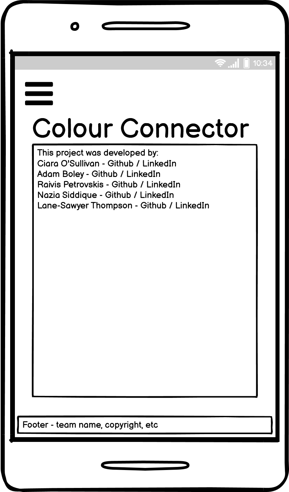

# The Colour Connector

# Code Institute May 2022 Hackathon

# Team - The Lightsabres

# Overview

The theme of the Code Insitute May 2022 hackathon was 'Getting Connected'. To begin with, we considered 4 ideas - a social media site for disabled users to discuss assistive technologies, a multiplayer game, a pub quiz, and a messenger app. Ultimately we went with the 4th idea, but incorporating elements of the 1st. 

The inspiration behind this project was a gift given to one of our team by his partner during the Covid-19 lockdowns. This gift was a colour lamp. One partner had one lamp, and the other partner had the other lamp. When one partner touches their lamp, the companion lamp lights up, which lets that person know that you are thinking of them. 

We thought that this was a very sweet idea, and an excellent way of combatting loneliness. Another team member who works with disabled patients informed us that people who rely on assistive technologies are significantly more prone to loneliness, so we decided to build the site with those people in mind, using a minimum amount of text, and using images and icons as much as possible. 

Our goal was to digitise this idea, and create an application that mimics the function of a colour lamp. Users can create accounts, log in and find their friends. Users can send friend requests to their friends, and once accepted, can send coloured messages and notes. The idea is for groups of users who perhaps do not see each other very often, or who cannot meet up, to maintain connections, and perhaps spark conversation using other apps and services, such as text messages or Facebook. 

[Am I Responsive](#)

# User Experience (UX)

## User Stories

Users must be able to determine the point of the site as soon as they navigate to it

Users must be to able create accounts easily

Returning users must be able to sign in easily

Users must be able to search for and find their friends

Users must be able to send friend requests

Users who have been sent friend requests must be able to accept and reject them

Once a pair of users are linked via an accepted friend request, they must be able to send messages and notes to each other

## User Experience in this Site
This website takes the users stories mentioned above into consideration to create a positive UX.  The users experience is discussed in more detail below with examples.

## Design

As the site was designed with disabled people in mind, we decided to use a light, positive colour palette, using blues, greens, oranges and yellows. 

## Design Research

## Design Wireframes

### Initial Wireframes

The wireframes below lay out how the initial design of the project, and the layout of its pages:

#### Desktop wireframes

#### Mobile wireframes

### Final Wireframes

As expected, the project's design changed significantly throughout the project. The final design wireframes are below:

#### Desktop

#### Mobile

## Favicon

The favicon used for this project is a miniaturised version of the image below:

We thought that since the project relies heavily on colour, an image of colours exploding was appropriate. 

# Features

The project uses the Python Django framework to allow users to create accounts and sign in. Once signed in, users can access the full features of the site. 

Once signed in, users may search for friends and send friend requests

Once a friend request has been accepted, linked users may send messages and monochromatic images to each other

When a user receives a message, it is displayed in their activty feed. The message contains a 200x200 image, and when clicked on, a modal activates and displays a larger version of the image. 

The project also includes an About page, which includes links to the LinkedIn and Github profiles of the team 

### Fonts
### Colour Scheme

# Design

## Landing Page

The Landing page is designed to be visually striking. The main feature is a video of two hands touching, symbolising the theme of connection that underpins the Hackathon. The words "Sometimes words are not enough" is a distillation of the theme of the app. Below are two buttons that take the user the Login and Signup pages. These buttons have user feedback, with the text colour and background colour switching when a user hovers over them. 

The text and the buttons are also set to fade in as the background video plays, and has been timed so that the text and buttons finish fading in as the colour reaches them. 

## About

The About page does not serve the app directly, but contains profiles for each of the team members that participated in building it. The page contains a neat bit of JavaScript coding that cycles the images of the team every three seconds. 

## Header

Each page has the same header, which was added with Bootstrap. It contains links to the Login, Signup and About pages, plus the app's name. 

## Footer

Each page has the same footer, which was added with Bootstrap. It contains the copyright and a link to the About page. 

## Error Pages

404 Page A customised 404 page not found was added to the site to support the professionalism design and ensure appropriate link was added back to the main site to guide users who come across this message.

# Future Work

The app has excellent potemtial for future work. The initial library of images that can be sent is small, but can be expanded significantly. The app could also be expanded with a chat function similar to those of traditional social media sites. 

# Testing

## Validation Testing

### HTML Validation

#### Landing page

2 errors and 1 warning were detected. 1 error related to the detection of a stray anchor tag, and the other related to the detection of a duplicate ID on Line 56. However, this is a consequence of using Bootstrap, so the error was ignored. 

#### About page

1 error and 1 warning were detected. The error related to the detection of a duplicate ID, but this is a consequence of Bootstrap, so it was ignored. 

### CSS Validation

No errors were detected in the style.css file

### JS Validation

No significant errors were detected in the scripts.js file

### PEP8 Python Validation

### Lighthouse testing

#### Landing page

All internal navigation links work as expected. 

#### Sign up page

The signup page currently does not work

#### Login page

Since the signup page does not work, the function of the login page cannot be tested

# Deployment

The project was deployed to Heroku. Unfortunately, some weeks prior to the start of the Hackathon, Github and Heroku suffered security breaches. This required the project to be deployed via the terminal using the following steps:
1. Login to Heroku using `heroku login -i`
2. Check that the login was successful by displaying the list of Heroku apps with `heroku apps`
3. Connect Heroku to the project repository with `heroku git:remote -a colour-connector`
4. Make a small change to the project so as to initiate the deployment process with `git add .` and `git commit -m "message"`
5. Push those changes to both Heroku and Github with the commands `git push origin main` and `git push heroku main`
6. On Heroku - select the heroku/python and heroky/nodejs buildpacks
7. Set the environment variables - 
8. small change

# Version Control
1.	The main repository was created by Adam Boley, and was then forked by all collaborators
2.	Branch protection was added to ensure pull requests were reviewed before merging
3.	Each team member ensured their development environment was linked by using the command:  `git remote -v` 
4.	For each new feature, team members created a new branch: `git checkout -b branch-name`
5.	To ensure this branch was being tracked: `git push -u origin branch-name`
6.	 In order to update the project files in their own work space, the command `git pull upstream main` was run after each team member's pull request was approved.
7.	Each team member used `git add .`, `git commit -m <message>` and `git push` to add, stage and save their work to their forked repositories. 
8.	When a team member finished a feature they made a Pull Request.  A template was used for this Pull Request so all team members information was structured the same.  This Pull Request was then checked by another member of the team.  If a merge conflict arose the team member would be notified by a comment otherwise the branch was merged.

# Bugs

Many bugs were encountered over the development of the project, mostly related to the implementation of Django. One particularly annoying bug stopped us from registering accounts. The offending code was in settings.py on line 153. This was changed to `EMAIL_HOST_PASSWORD = os.environ.get('EMAIL_HOST_PASS')`, which fixed the bug and allowed users to register

### Cloning

### Content
### Media

# Credits

## Team

 Adam Boley - [Github](https://github.com/AdamBoley), [LinkedIn](https://www.linkedin.com/in/adam-boley-196420a8/)
 Ciara O'Sullivan - [Github](https://github.com/ciaraosull), [LinkedIn](https://www.linkedin.com/in/ciara-o-sullivan-2834378b/)
 Nazia Siddique - [Github](https://github.com/NaziaSiddique), [LinkedIn]()
 Raivis Petrovskis  - [Github](https://github.com/Raivis80), [LinkedIn](https://www.linkedin.com/in/raivis-petrovskis/)
 Lane-Sawyer Thompson - [Github](https://github.com/LaneSawyerT), [LinkedIn](https://www.linkedin.com/in/lanesawyert/)

## Resources

[This site](https://amasty.com/blog/30-best-meet-the-team-pages-examples-and-trends/) was used as the inspiration of the about page

[This Stack Overflow question](https://stackoverflow.com/questions/4941004/putting-images-with-options-in-a-dropdown-list) was used to create a drop down menu with users and avatar images

## Acknowledgements

Trust in SODA - 